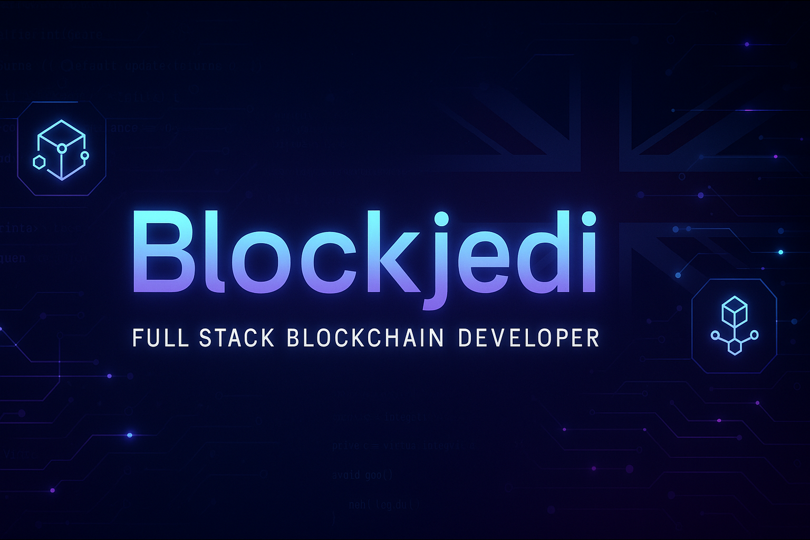

<!-- Banner -->

  

<h1 align="center">Hi 👋, I'm Hussam Mustafa</h1>
<h3 align="center">aka Blockjedi — Blockchain Developer from the UK 🇬🇧</h3>

---

### 🚀 About Me

- 🔭 Currently building:
  - 🧬 Vanar Chain – Layer 1 Blockchain for Gaming, AI, and FinTech
  - 🪐 [Virtua](https://virtua.com)
- 🌱 Currently learning: **Go**
- 💬 Ask me about: `Solidity`, `Ethereum`, `Polygon`, `Solana`, `Cardano`
- 📫 Reach me at: **hussammustafa786@gmail.com**
- ⚡ Fun fact: *I think I’m funny 😄*

---

### 🧠 Highlight Projects

| Project | Description |
|--------|-------------|
| 🪐 [Virtua](https://virtua.com) | Metaverse platform for NFTs, avatars & collectibles |
| 🧬 Vanar Chain | Scalable Layer 1 blockchain for AI, gaming & finance |
| 🌍 Next2Explore | Travel booking system for tours, hotels & taxis |
| 🧱 Erdbaron | Mobile tool for soil/land evaluation & certification |

---

### 🧰 Tech Stack

**Languages & Frameworks:**  
`JavaScript` • `TypeScript` • `Rust` • `Python` • `Go` • `Solidity`  

**Frontend:**  
`React` • `Vue` • `Angular` • `Tailwind CSS` • `Vuetify` • `Bootstrap`  

**Backend & Blockchain:**  
`Node.js` • `NestJS` • `Ethers.js` • `Wagmi` • `Privy` • `Hardhat`  

**Cloud & DevOps:**  
`Docker` • `Kubernetes` • `Firebase` • `Heroku` • `AWS` • `Azure`  

**Databases:**  
`MongoDB` • `PostgreSQL` • `MySQL` • `Redis`

---

### 🌐 Connect with Me

- [🔗 LinkedIn](https://www.linkedin.com/in/hussam-mustafa-472341114/)
- [🐦 X](https://x.com/web3_jedi)
- 📬 **Email:** hussam.mustafa112@outlook.com

---

### ☕ Support My Work

---

> _"Code like you’re changing the world. Because you probably are."_ ✨
